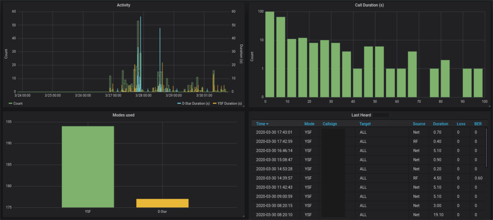

# Pi-Star Scraper

This Python script scrapes the data from a given Pi-Star dashboard and stores
the information into a database.
For now, only InfluxDB is supported, but other database types would work also.
With having this information stored persistently, you can do various statistics
and visualisations, e.g. using Grafana.



Tested with Pi-Star 4.1.3

## Usage

### Commandline arguments

```bash
pistar-scraper.py [-h] --url URL --db_host DB_HOST [--db_port DB_PORT]
                         [--db_name DB_NAME]
```

### Example

```bash
python3 pistar-scraper.py --url http://pi-star.local --db_host localhost
```
